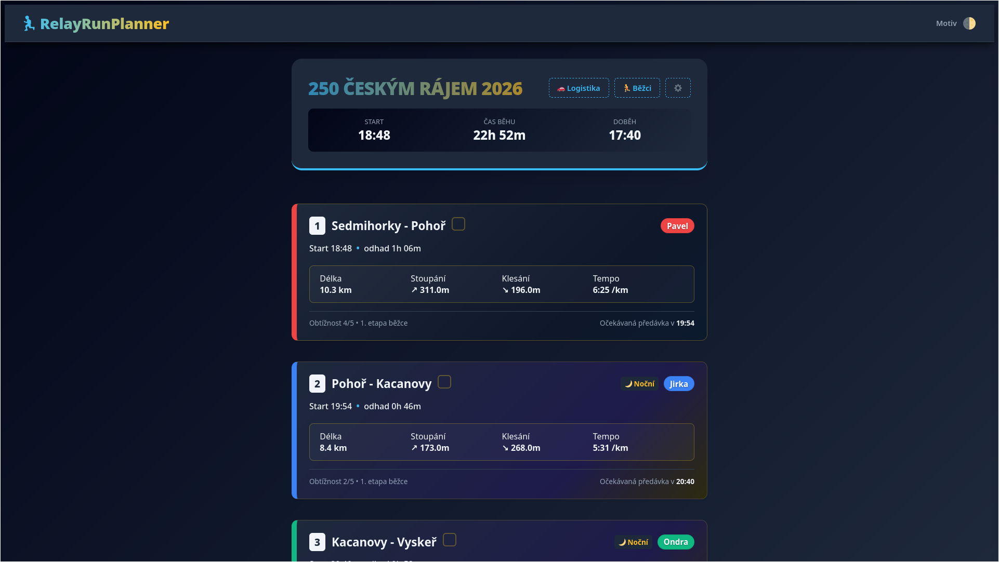
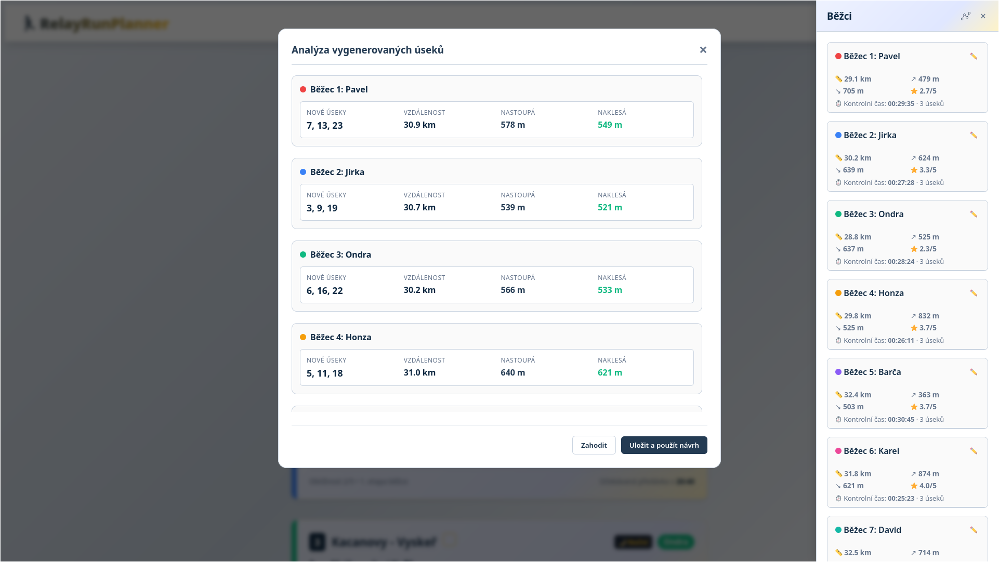
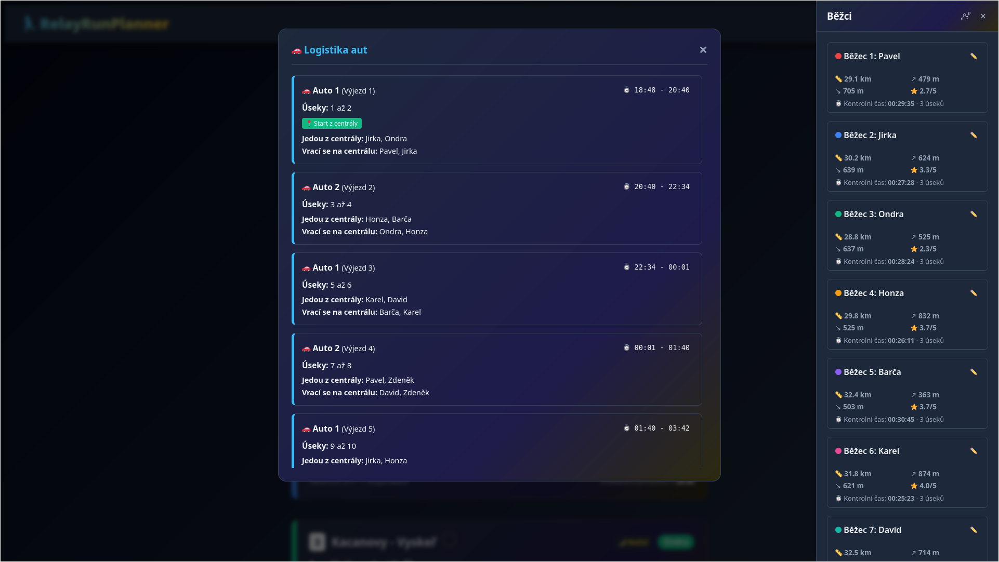

<p align="center">
  <a href="#cíl">Cíl</a> •
  <a href="#hlavní-funkce">Hlavní funkce</a> •
  <a href="#spuštění">Spuštění</a> •
  <a href="#použití">Použití</a> •
  <a href="#jak-to-funguje">Jak to funguje</a> •
  <a href="#galerie">Galerie</a> •
  <a href="#licence">Licence</a>
</p>

#  RelayRunPlanner


**RelayRunPlanner** je webová aplikace pro správu, matematickou optimalizaci a logistické plánování dlouhých štafetových závodů (např. [*Vltava Run*](https://www.vltavarun.cz/), [*JizeRun*](https://www.jizerun.cz/), [*250 Českým rájem*](https://250cr.cz/) a další).

Veškeré výpočty probíhají **přímo v prohlížeči** – data závodů se ukládají lokálně do **localStorage** (v mezipaměti).

Díky optimalizačním algoritmům odstraňuje hodiny ručního plánování a nahrazuje je řešením na jedno kliknutí.

## Cíl

Aplikace byla vytvořena k plánování štafetového závodu s 5 až 12 běžci na 15+ úsecích s využitím 1+ doprovodných vozidel. Jde o složitý logistický a kombinatorický problém. Organizátor týmu typicky čelí následujícím výzvám:

1. **Spravedlivé rozdělení zátěže:** Každý běžec by měl uběhnout podobnou celkovou vzdálenost a nastoupat srovnatelné výškové metry s ohledem na své individuální preference a výkonnost.
2. **Dodržení odpočinku:** Mezi jednotlivými běhy stejného běžce musí být garantována dostatečně dlouhá pauza na regeneraci a spánek.
3. **Logistická omezení aut:** Běžci sedící ve stejném autě se musí střídat tak, aby auto mohlo přejet na další předávku a posádka měla čas na přesun a odpočinek.
4. **Vliv terénu a predikce:** Jednoduchý přepočet podle čistého běžeckého tempa na rovině selhává v kopcovitém terénu. Je nutné modelovat vliv převýšení na rychlost běhu.
5. **Noční bezpečnost:** Je kritické vědět, kteří běžci poběží za tmy, aby byli včas připraveni s čelovkami a reflexními prvky.

**RelayRunPlanner řeší všechny tyto aspekty najednou.** Vytváří spravedlivé rozpisy běžců, optimalizuje logistiku aut pro lineární i okruhové závody s centrální základnou a poskytuje sledování závodu přímo na trati s adaptivním přepočtem časů.

## Hlavní funkce

* **Matematická optimalizace (ILP):** Rozřazení běžců na úseky pomocí celočíselného lineárního programování ([glpk.js](https://www.npmjs.com/package/glpk.js) + WebAssembly), běžící v hlavním vlákně prohlížeče.
* **Dva logistické režimy:**
  * *Lineární trasa (např. Vltava Run):* Fixní střídání posádek aut v souvislých blocích.
  * *Trasa s centrálou (např. 250ČR):* Auta se vrací do centrálního kempu; dynamické programování hledá optimální délky výjezdů.
* **Dynamická predikce časů:** Výpočet očekávaného času na základě délky, stoupání a individuálního tempa z kontrolního běhu (koeficient: 100 m převýšení = 1 km roviny).
* **Automatická detekce nočních úseků:** Výpočet času východu a západu slunce pro dané datum a souřadnice (knihovna [SunCalc](https://github.com/mourner/suncalc) z CDN), úseky vyžadující čelovku jsou označeny (tolerance 30 minut).
* **Sledování průběhu závodu:** Odškrtávání hotových úseků a zadávání reálných časů; aplikace přepočítá predikované starty a doběhy zbývajících úseků.
* **Bezserverové sdílení stavu:** Aktuální průběh závodu (reálné časy doběhů, přiřazení běžců) lze poslat odkazem nebo QR kódem – druhý uživatel si ho importuje do svého prohlížeče (localStorage), bez backendu.
* **Offline-first:** Po načtení stránky funguje bez serveru; závody přežijí obnovení prohlížeče díky localStorage.
* **Předvyplněné trasy:** Šablony pro JizeRun (15 úseků), 250ČR (24) a Vltava Run (36) jsou součástí aplikace.

## Spuštění

Aplikace nevyžaduje instalaci závislostí ani build kroky. Stačí statický HTTP server (kvůli načítání skriptů a WASM; otevření souboru přes `file://` nedoporučujeme).

### Lokální vývoj

```bash
git clone https://github.com/tucnakomet1/RelayRunPlanner.git
cd RelayRunPlanner

# libovolný jednoduchý HTTP server, např.:
python3 -m http.server 8080
# nebo: npx --yes serve .
```

Poté otevřete v prohlížeči např. [http://localhost:8080/](http://localhost:8080/) (nebo port, který server vypíše).

> [!NOTE]
> **Sdílení mezi telefony** vyžaduje HTTP/HTTPS adresu (localhost, GitHub Pages apod.). Při otevření souboru přes `file://` lze odkaz zkopírovat, ale QR kód pro sdílení na jiné zařízení nefunguje.

*Dřívější verze běžela na **Pythonu (Flask)** s knihovnami PuLP a Astral. Aktuální verze je kompletně přepsaná do JavaScriptu*

## Použití

Používání aplikace je rozděleno do tří kroků:

### Krok 1: Založení závodu

Na úvodní obrazovce zadejte:

* **Název závodu** (např. *Vltava Run 2026*).
* **Start závodu** – datum a čas startu prvního běžce (pro výpočet nočních úseků podle souřadnic trasy).
* **Celkový počet úseků** (např. `36` pro Vltava Run, `24` pro 250ČR, `15` pro JizeRun).

Uložené závody se zobrazí v seznamu; výběrem přejdete na dashboard existujícího závodu (`#race/<id>`).

### Krok 2: Nahrání trasy a nastavení týmu

#### A. Nahrání trasy (JSON)

Trať se nahrává jako JSON (soubor nebo předvyplněná šablona). K dispozici jsou šablony pro **15 / 24 / 36** úseků (JizeRun, 250ČR, Vltava Run). Kompletní příklady tras jsou také v souboru [`templates.js`](static/js/templates.js).

> [!TIP]
> **Inteligentní detekce délky:** Hodnota `delka_km` větší než 500 (např. `9300`) se bere jako **metry** a převede na km (`9.3`). Hodnota ≤ 500 (např. `9.3`) se bere přímo jako kilometry.

**Příklad JSON:**

```json
[
  {
    "usek_id": 1,
    "nazev": "Kvilda - Borová Lada",
    "delka_km": 9300,
    "stoupani_m": 89,
    "klesani_m": 28,
    "obtiznost": 2
  },
  {
    "usek_id": 2,
    "nazev": "Borová Lada - Strážný",
    "delka_km": 12.2,
    "stoupani_m": 143,
    "klesani_m": 309,
    "obtiznost": 3
  }
]
```

Podporovány jsou i anglické aliasy polí (`id`, `name`, `dist`, `elev_up`, `elev_down`).

#### B. Nastavení běžců

Pro každého běžce: jméno, cílový počet úseků, referenční běh (vzdálenost v metrech, čas `HH:MM:SS`, převýšení). Volitelně **globální kontrolní úsek** pro celý tým nebo **náhodné přiřazení** úseků bez ručního zadání čísel.

Po vyplnění: **„Vygenerovat plán závodu“** – uložení do localStorage a přechod na dashboard.

### Krok 3: Dashboard, optimalizace a logistika

#### A. Sledování průběhu

U úseků lze označit **Hotovo** a zadat reálné časy. Aplikace adaptivně přepočítá předpokládané časy následujících úseků. Zároveň vypočítá zlepšení/zhoršení daného běžce a upraví podle toho časy jeho následujících úseků.

#### B. Smart generování (ILP)

1. Postranní panel **„Běžci“** →  → **„Pokročilé generování s pravidly“**.
2. **Minimální pauza (gap)** mezi běhy stejného běžce (např. pauza `3` znamená, že po odběhnutí úseku běžec 3 následující úseky povinně odpočívá než poběží další).
3. Zadejte **Počet aut** v týmu a rozdělte běžce do konkrétních posádek (např. Auto 1 a Auto 2).
4. Pokud plánujete závod s centrální základnou, zaškrtněte volbu **"Máme centrálu"**.
5. **„Vygenerovat“** – solver běží v prohlížeči (diagnostický log v modalu). 

Celočíselný lineární program během chvíle najde optimální rozpis respektující všechna omezení. Výsledný plán si můžete před uložením přehledně analyzovat v přehledových kartách.

Solver postupně zkouší: plný model (gap + rovnoměrné rozložení úseků), model bez spread omezení, postupné snížení gapu. Po nalezení řešení proběhne **post-processing** pro vyrovnání náročnosti úseků mezi běžci (`postProcessPerformanceMatching`).

Alternativně lze použít **náhodné generování** úseků s následným vyrovnáním obtížnosti.

#### C. Logistika aut

Tlačítko **„Logistika“** v záhlaví:

* **Bez centrály:** Souvislé bloky trasy, rotace celých aut.
* **S centrálou:** Výjezdy 2–4 úseky, role Outbound / Returning, volitelné označení úseků začínajících/končících v centrále.

Výsledek logistiky se ukládá k závodu v localStorage.

#### D. Sdílení stavu závodu

Na dashboardu závodu (krok 3) tlačítko **„🔗 Sdílet stav“** v záhlaví:

1. Aplikace uloží aktuální závod z localStorage (včetně označených úseků **Hotovo** a zadaných reálných časů).
2. Stav se zkomprimuje ([LZ-String](https://pieroxy.net/blog/pages/lz-string/index.html)) a vloží do URL za hashtag: `index.html#race_data=…`
3. V modalu se zobrazí **QR kód** odkazu a pole pro **zkopírování** – druhý člen týmu ho otevře na telefonu nebo naskenuje QR.

**Import na druhém zařízení:** Po otevření odkazu se závod automaticky uloží do localStorage a zobrazí se dashboard. Pokud závod se stejným ID už existuje, data se přepíší aktuálním sdíleným stavem.

**Omezení:**

* U velmi rozsáhlých závodů může být odkaz příliš dlouhý pro QR kód – vždy funguje zkopírování odkazu (např. přes messenger).
* Data zůstávají jen v prohlížeči příjemce – žádný server je neukládá.
* Technicky: [`static/js/share.js`](static/js/share.js), knihovny LZ-String a [qrcodejs](https://github.com/davidshimjs/qrcodejs) z CDN.

---

## Jak to funguje

### 1. Modelování terénu (ekvivalentní vzdálenost)

Převýšení se převádí na fiktivní rovinné kilometry:

$$d_{eq} = d + \frac{e_{up}}{100}$$

* $d$ – délka úseku v km  
* $e_{up}$ – stoupání v metrech  

Stejný princip se používá pro tempo z kontrolního běhu i pro predikci času na úseku.

*Příklad:* Běh na 10 km s převýšením 200 metrů odpovídá náročnosti běhu na 12 km po rovině ($10 + 200/100 = 12$).

### 2. Optimalizace rozdělení (ILP)

Proces přiřazení je formulován jako matematická optimalizace celočíselného lineárního programování. Cílem je minimalizovat celkovou absolutní odchylku uběhnutých kilometrů a nastoupaných metrů každého běžce od spravedlivého průměru týmu:

$$\min \sum_{r \in R} \left( |D_r - \bar{D}_r| + 0.01 \times |E_r - \bar{E}_r| \right)$$

Přiřazení běžců k úsekům je **problém feasibility** s binárními proměnnými $x_{r,s}$ (běžec $r$ běží úsek $s$). Solver hledá libovolné přípustné řešení za omezení:

1. Každý úsek obsazen právě jedním běžcem.
2. Každý běžec uběhne přesně svůj cílový počet úseků.
3. Mezi běhy stejného běžce je minimální odstup (gap).
4. V lineárním režimu smí běžec běžet jen úseky „svého“ auta.
5. Volitelně: úseky jednoho běžce rovnoměrně po délce závodu (spread).

**Spravedlivé rozdělení náročnosti** (vzdálenost + převýšení) řeší následný **post-processing** výměnou úseků mezi běžci, nikoli přímo v cílové funkci ILP.

### 3. Logistika

* **Lineární:** Trať se rozdělí na bloky podle počtu běžců v autě; auta se střídají v pevném pořadí.
* **Centrální:** Dynamické programování minimalizuje počet výjezdů při omezení délky bloku (2–4 úseky) a respektuje přiřazení běžců k autům.

---

## Galerie

### Dashboard závodu

*Přehled úseků, predikované časy, noční úseky, sledování průběhu.*



### Konfigurace ILP optimalizace

*Minimální odpočinek, rozřazení běžců do vozidel, diagnostika solveru.*



### Plánování logistiky aut

*Přejezdy aut, logistické bloky, instrukce pro posádky.*



## Licence

Tento projekt je licencován pod licencí [MIT](LICENSE).

---

*Rozšířený matematický popis a původní formulace modelu: [docs/relayrun.tex](docs/relayrun.tex) (kompilace do PDF dle potřeby).*
